# 🗄️ Schéma Complet Base de Données FADIDI - 23 Tables

## 📋 Vue d'ensemble

La base de données **`fadidi_new_db`** contient **23 tables** qui gèrent l'ensemble du système e-commerce FADIDI. Le fichier a été mis à jour après vérification directe de la base (liste fournie). Voici la documentation complète de toutes les tables avec leurs structures, relations et usages.

## 🎯 Architecture Générale

```
┌─────────────────────────────────────────────────────────────────┐
│                    BASE DE DONNÉES FADIDI                      │
│                     fadidi_new_db (MySQL)                      │
└─────────────────────────────────────────────────────────────────┘
                                │
                                ▼
┌──────────────────┬──────────────────┬──────────────────────────┐
│   👥 UTILISATEURS │   🛒 COMMERCE    │    📢 MARKETING         │
│   & SÉCURITÉ     │   & COMMANDES    │    & PUBLICITÉ          │
├──────────────────┼──────────────────┼──────────────────────────┤
│ users            │ products         │ floating_ads             │
│ auth_codes       │ categories       │ header_banners          │
│ security_settings│ promotions       │ annonces                │
│ subscribers      │ orders           │ annonce_images          │
│                  │ revenues         │                         │
└──────────────────┴──────────────────┴──────────────────────────┘
```

---

## 📊 TABLES DÉTAILLÉES - ORDRE NUMÉRIQUE (1 à 23)

### 🔐 **1. ACCESS_CODE** - Codes d'accès utilisateurs
```sql
CREATE TABLE access_code (
  id INT PRIMARY KEY AUTO_INCREMENT,
  code VARCHAR(255) NOT NULL,
  label VARCHAR(255),
  expiresAt DATETIME,
  isUsed BOOLEAN DEFAULT false,
  createdAt TIMESTAMP DEFAULT CURRENT_TIMESTAMP
);
```
**Usage :** Codes d'accès générés pour des usages frontaux (ex: promotions, accès restreint).

---

### 🔐 **2. ADMIN_ACCESS_CODE** - Codes d'administration
```sql
CREATE TABLE admin_access_code (
  id INT PRIMARY KEY AUTO_INCREMENT,
  code VARCHAR(255) NOT NULL UNIQUE,
  createdBy VARCHAR(36), -- id admin
  expiresAt DATETIME,
  isUsed BOOLEAN DEFAULT false,
  createdAt TIMESTAMP DEFAULT CURRENT_TIMESTAMP
);
```
**Usage :** Codes d'accès temporaires pour administration (login ou opérations sensibles).

---

### 🖼️ **3. ANNONCE_IMAGES** - Images des Annonces
```sql
CREATE TABLE annonce_images (
  id INT PRIMARY KEY AUTO_INCREMENT,       -- ID unique
  titre VARCHAR(255) NOT NULL,             -- Titre de l'image
  description TEXT NOT NULL,               -- Description de l'image
  type VARCHAR(100) NOT NULL,              -- Type d'image
  imageBase64 LONGTEXT NOT NULL,           -- Image encodée en Base64
  annonce_id INT NOT NULL,                 -- Référence vers annonces
  FOREIGN KEY (annonce_id) REFERENCES annonces(id) ON DELETE CASCADE
);
```
**Usage :** Stockage des images des annonces avec encodage Base64.

---

### 📺 **4. ANNONCES** - Système d'Annonces
```sql
CREATE TABLE annonces (
  id INT PRIMARY KEY AUTO_INCREMENT,       -- ID unique
  type VARCHAR(100) NOT NULL,              -- Type d'annonce
  titre VARCHAR(255) NOT NULL,             -- Titre de l'annonce
  description TEXT NOT NULL,               -- Description détaillée
  pageCible VARCHAR(255) NOT NULL,         -- Page cible d'affichage
  redirectionUrl VARCHAR(500),             -- URL de redirection
  animation VARCHAR(100),                  -- Type d'animation
  active BOOLEAN DEFAULT true,             -- Annonce active
  vues INT DEFAULT 0,                      -- Nombre de vues
  clics INT DEFAULT 0,                     -- Nombre de clics
  vuesIndex INT DEFAULT 0,                 -- Vues sur la page d'index
  clicsIndex INT DEFAULT 0                 -- Clics sur la page d'index
);
```
**Usage :** Gestion des annonces avec ciblage de pages et suivi détaillé.

---

### 📣 **5. ANNOUNCEMENTS** - Annonces globales
```sql
CREATE TABLE announcements (
  id INT PRIMARY KEY AUTO_INCREMENT,
  title VARCHAR(255) NOT NULL,
  content TEXT NOT NULL,
  isActive BOOLEAN DEFAULT true,
  startDate DATETIME,
  endDate DATETIME,
  createdAt TIMESTAMP DEFAULT CURRENT_TIMESTAMP
);
```
**Usage :** Messages globaux ou info-bulles affichées sur le site (distinct de `annonces` qui est une table francophone existante).

---

### 🔐 **6. AUTH_CODES** - Codes d'Accès Temporaires
```sql
CREATE TABLE auth_codes (
  id VARCHAR(36) PRIMARY KEY,              -- UUID unique
  code VARCHAR(255) UNIQUE NOT NULL,       -- Code d'accès
  label VARCHAR(255),                      -- Libellé du code
  expiresAt DATETIME NOT NULL,             -- Date d'expiration
  isUsed BOOLEAN DEFAULT false,            -- Code utilisé
  createdAt TIMESTAMP DEFAULT CURRENT_TIMESTAMP
);
```
**Usage :** Génération de codes d'accès temporaires pour l'administration.

---

### 🛒 **7. CART** - Panier côté serveur
```sql
CREATE TABLE cart (
  id INT PRIMARY KEY AUTO_INCREMENT,
  sessionId VARCHAR(255) NOT NULL,
  userId VARCHAR(36),
  items JSON NOT NULL,
  subtotal DECIMAL(10,2) DEFAULT 0,
  createdAt TIMESTAMP DEFAULT CURRENT_TIMESTAMP,
  updatedAt TIMESTAMP DEFAULT CURRENT_TIMESTAMP ON UPDATE CURRENT_TIMESTAMP
);
```
**Usage :** Sauvegarde du panier serveur (synchronisation avec localStorage côté front).

---

### 🏷️ **8. CATEGORIES** - Catégories de Produits
```sql
CREATE TABLE categories (
  id VARCHAR(36) PRIMARY KEY,              -- UUID unique
  name VARCHAR(255) UNIQUE NOT NULL,       -- Nom de la catégorie
  description TEXT,                        -- Description détaillée
  image VARCHAR(500),                      -- Image de la catégorie
  sortOrder INT DEFAULT 0,                 -- Ordre d'affichage
  isActive BOOLEAN DEFAULT true,           -- Catégorie active/inactive
  createdAt TIMESTAMP DEFAULT CURRENT_TIMESTAMP,
  updatedAt TIMESTAMP DEFAULT CURRENT_TIMESTAMP ON UPDATE CURRENT_TIMESTAMP
);
```
**Usage :** Classification des produits par catégories (Électronique, Vêtements, etc.).

---

### 📢 **9. FLOATING_ADS** - Publicités Flottantes
```sql
CREATE TABLE floating_ads (
  id INT PRIMARY KEY AUTO_INCREMENT,       -- ID unique
  title VARCHAR(255) NOT NULL,             -- Titre de la publicité
  content TEXT NOT NULL,                   -- Contenu de la publicité
  displayMode ENUM('toast', 'popup', 'banner') DEFAULT 'banner',
  position ENUM('top-left', 'top-right', 'top-center', 'bottom-left', 'bottom-right', 'bottom-center', 'center') DEFAULT 'bottom-right',
  width VARCHAR(50) DEFAULT '300px',       -- Largeur
  height VARCHAR(50) DEFAULT '200px',      -- Hauteur
  backgroundColor VARCHAR(16) DEFAULT '#ffffff',  -- Couleur de fond
  textColor VARCHAR(16) DEFAULT '#000000', -- Couleur du texte
  targetPages TEXT,                        -- Pages ciblées (séparées par virgule)
  redirectUrl VARCHAR(500),                -- URL de redirection
  imageUrl VARCHAR(500),                   -- URL de l'image
  isActive BOOLEAN DEFAULT true,           -- Publicité active
  startDate DATETIME,                      -- Date de début
  endDate DATETIME,                        -- Date de fin
  clickCount INT DEFAULT 0,                -- Nombre de clics
  viewCount INT DEFAULT 0,                 -- Nombre d'affichages
  redisplayDelay INT DEFAULT 0,            -- Délai de réaffichage (secondes)
  createdAt TIMESTAMP DEFAULT CURRENT_TIMESTAMP,
  updatedAt TIMESTAMP DEFAULT CURRENT_TIMESTAMP ON UPDATE CURRENT_TIMESTAMP
);
```
**Usage :** Gestion des publicités flottantes avec ciblage de pages et analytics.

---

### 🖼️ **10. FLOATING_ADS_SLIDESHOW** - Slideshow des publicités flottantes
```sql
CREATE TABLE floating_ads_slideshow (
  id INT PRIMARY KEY AUTO_INCREMENT,
  title VARCHAR(255),
  isActive BOOLEAN DEFAULT true,
  createdAt TIMESTAMP DEFAULT CURRENT_TIMESTAMP
);
```
**Usage :** Regroupe des slides pour un carrousel de publicités.

---

### 🖼️ **11. FLOATING_ADS_SLIDESHOW_IMAGE** - Images du slideshow
```sql
CREATE TABLE floating_ads_slideshow_image (
  id INT PRIMARY KEY AUTO_INCREMENT,
  slideshow_id INT NOT NULL,
  imageUrl VARCHAR(500),
  caption VARCHAR(255),
  FOREIGN KEY (slideshow_id) REFERENCES floating_ads_slideshow(id) ON DELETE CASCADE
);
```
**Usage :** Images individuelles rattachées à un slideshow publicitaire.

---

### 📁 **12. FLOATING_ADS_TEMPLATES** - Templates publicités
```sql
CREATE TABLE floating_ads_templates (
  id INT PRIMARY KEY AUTO_INCREMENT,
  name VARCHAR(255) NOT NULL,
  templateHtml TEXT NOT NULL,
  createdAt TIMESTAMP DEFAULT CURRENT_TIMESTAMP
);
```
**Usage :** Gabarits réutilisables pour publicités flottantes.

---

### 🎨 **13. HEADER_BANNERS** - Bannières d'En-tête
```sql
CREATE TABLE header_banners (
  id INT PRIMARY KEY AUTO_INCREMENT,       -- ID unique
  title VARCHAR(255) NOT NULL,             -- Titre de la bannière
  description TEXT,                        -- Description
  imageUrl VARCHAR(500) NOT NULL,          -- URL de l'image
  linkUrl VARCHAR(500),                    -- URL de destination
  isActive BOOLEAN DEFAULT true,           -- Bannière active
  displayOrder INT DEFAULT 0,              -- Ordre d'affichage
  displayDuration INT DEFAULT 5000,        -- Durée d'affichage (ms)
  customStyles TEXT,                       -- CSS personnalisé
  imagePosition VARCHAR(20) DEFAULT 'center', -- Position de l'image
  viewCount INT DEFAULT 0,                 -- Nombre de vues
  clickCount INT DEFAULT 0,                -- Nombre de clics
  createdAt TIMESTAMP DEFAULT CURRENT_TIMESTAMP,
  updatedAt TIMESTAMP DEFAULT CURRENT_TIMESTAMP ON UPDATE CURRENT_TIMESTAMP
);
```
**Usage :** Carrousel de bannières en haut des pages avec analytics intégrés.

---

### 📦 **14. ORDER_ITEMS** - Articles de commande (détail)
```sql
CREATE TABLE order_items (
  id INT PRIMARY KEY AUTO_INCREMENT,
  orderId INT NOT NULL,
  productId VARCHAR(36) NOT NULL,
  quantity INT NOT NULL,
  unitPrice DECIMAL(10,2) NOT NULL,
  totalPrice DECIMAL(10,2) NOT NULL,
  FOREIGN KEY (orderId) REFERENCES orders(id) ON DELETE CASCADE
);
```
**Usage :** Détail des articles constituant une commande (normalisation de `orders.items`).

---

### 📋 **15. ORDERS** - Commandes Client
```sql
CREATE TABLE orders (
  id INT PRIMARY KEY AUTO_INCREMENT,       -- ID numérique croissant
  customerName VARCHAR(255) NOT NULL,      -- Nom du client
  customerPhone VARCHAR(50) NOT NULL,      -- Téléphone du client
  customerEmail VARCHAR(255),              -- Email du client
  deliveryAddress TEXT NOT NULL,           -- Adresse de livraison
  deliveryCity VARCHAR(100) NOT NULL,      -- Ville de livraison
  deliveryTime VARCHAR(100),               -- Créneau de livraison
  deliveryNotes TEXT,                      -- Notes de livraison
  items JSON NOT NULL,                     -- Articles commandés (JSON)
  subtotal DECIMAL(10,2) NOT NULL,         -- Sous-total
  deliveryFee DECIMAL(10,2) NOT NULL,      -- Frais de livraison
  total DECIMAL(10,2) NOT NULL,            -- Total final
  paymentMethod ENUM('wave', 'orange', 'card', 'promotion') NOT NULL,
  status ENUM('pending', 'confirmed', 'paid', 'processing', 'shipped', 'delivered', 'cancelled') DEFAULT 'pending',
  source VARCHAR(50),                      -- Source de la commande
  paymentDate TIMESTAMP NULL,              -- Date du paiement
  customerFeedback TEXT,                   -- Retour client
  feedbackType VARCHAR(50),                -- Type de retour
  feedbackDate TIMESTAMP NULL,             -- Date du retour
  adminResponse TEXT,                      -- Réponse admin
  adminResponseDate TIMESTAMP NULL,        -- Date réponse admin
  deliveredAt TIMESTAMP NULL,              -- Date de livraison
  createdAt TIMESTAMP DEFAULT CURRENT_TIMESTAMP,
  updatedAt TIMESTAMP DEFAULT CURRENT_TIMESTAMP ON UPDATE CURRENT_TIMESTAMP
);
```
**Usage :** Gestion complète des commandes avec suivi du statut et feedback client.

---

### 💳 **16. PAYMENTS** - Paiements
```sql
CREATE TABLE payments (
  id INT PRIMARY KEY AUTO_INCREMENT,
  orderId INT NOT NULL,
  provider VARCHAR(50), -- wave, orange, card, etc.
  providerReference VARCHAR(255),
  amount DECIMAL(10,2) NOT NULL,
  currency VARCHAR(10) DEFAULT 'XOF',
  status ENUM('pending','successful','failed','refunded') DEFAULT 'pending',
  paidAt TIMESTAMP NULL,
  createdAt TIMESTAMP DEFAULT CURRENT_TIMESTAMP,
  FOREIGN KEY (orderId) REFERENCES orders(id) ON DELETE CASCADE
);
```
**Usage :** Enregistrement des paiements liés aux commandes (multi-moyens).

---

### 📦 **17. PRODUCTS** - Produits du Catalogue
```sql
CREATE TABLE products (
  id VARCHAR(36) PRIMARY KEY,              -- UUID unique
  name VARCHAR(255) NOT NULL,              -- Nom du produit
  description TEXT,                        -- Description complète
  price DECIMAL(10,2) NOT NULL,            -- Prix unitaire
  categoryId VARCHAR(36),                  -- Référence vers categories
  image VARCHAR(500),                      -- Image principale
  images JSON,                             -- Galerie d'images (JSON)
  status ENUM('draft', 'published', 'archived') DEFAULT 'draft',
  isFeatured BOOLEAN DEFAULT false,        -- Produit mis en avant
  stock INT DEFAULT 0,                     -- Quantité en stock
  weight DECIMAL(8,2),                     -- Poids pour livraison
  dimensions VARCHAR(100),                 -- Dimensions (L×l×h)
  tags JSON,                               -- Mots-clés de recherche
  seoTitle VARCHAR(255),                   -- Titre pour SEO
  seoDescription TEXT,                     -- Description pour SEO
  viewCount INT DEFAULT 0,                 -- Nombre de vues
  soldCount INT DEFAULT 0,                 -- Nombre de ventes
  createdAt TIMESTAMP DEFAULT CURRENT_TIMESTAMP,
  updatedAt TIMESTAMP DEFAULT CURRENT_TIMESTAMP ON UPDATE CURRENT_TIMESTAMP,
  FOREIGN KEY (categoryId) REFERENCES categories(id)
);
```
**Usage :** Catalogue principal des produits avec gestion complète des stocks et SEO.

---

### 🎯 **18. PROMOTIONS** - Offres Spéciales
```sql
CREATE TABLE promotions (
  id VARCHAR(36) PRIMARY KEY,              -- UUID unique
  title VARCHAR(255) NOT NULL,             -- Titre de la promotion
  description TEXT,                        -- Description détaillée
  originalPrice DECIMAL(10,2) NOT NULL,    -- Prix original
  promotionPrice DECIMAL(10,2) NOT NULL,   -- Prix promotionnel
  discountPercentage DECIMAL(5,2) NOT NULL,-- Pourcentage de réduction
  startDate DATETIME NOT NULL,             -- Date de début
  endDate DATETIME NOT NULL,               -- Date de fin
  status ENUM('draft', 'active', 'expired', 'paused') DEFAULT 'draft',
  image VARCHAR(500),                      -- Image de la promotion
  maxQuantity INT DEFAULT 0,               -- Stock limité (0 = illimité)
  soldQuantity INT DEFAULT 0,              -- Quantité vendue
  isFeatured BOOLEAN DEFAULT false,        -- Promotion en vedette
  productId VARCHAR(36),                   -- Produit associé
  categoryId VARCHAR(36),                  -- Catégorie associée
  viewCount INT DEFAULT 0,                 -- Nombre de vues
  clickCount INT DEFAULT 0,                -- Nombre de clics
  createdAt TIMESTAMP DEFAULT CURRENT_TIMESTAMP,
  updatedAt TIMESTAMP DEFAULT CURRENT_TIMESTAMP ON UPDATE CURRENT_TIMESTAMP,
  FOREIGN KEY (productId) REFERENCES products(id),
  FOREIGN KEY (categoryId) REFERENCES categories(id)
);
```
**Usage :** Gestion des offres promotionnelles temporaires avec suivi des performances.

---

### 📢 **19. PUBLICITES** - Publicités (version francophone)
```sql
CREATE TABLE publicites (
  id INT PRIMARY KEY AUTO_INCREMENT,
  titre VARCHAR(255),
  contenu TEXT,
  imageUrl VARCHAR(500),
  isActive BOOLEAN DEFAULT true,
  createdAt TIMESTAMP DEFAULT CURRENT_TIMESTAMP
);
```
**Usage :** Table supplémentaire de publicités. Peut coexister avec `floating_ads` et `header_banners`.

---

### 💰 **20. REVENUES** - Chiffre d'Affaires
```sql
CREATE TABLE revenues (
  id INT PRIMARY KEY AUTO_INCREMENT,       -- ID unique
  total DECIMAL(15,2) NOT NULL DEFAULT 0,  -- Chiffre d'affaires total
  updatedAt TIMESTAMP DEFAULT CURRENT_TIMESTAMP ON UPDATE CURRENT_TIMESTAMP
);
```
**Usage :** Suivi du chiffre d'affaires global avec historique des mises à jour.

---

### ⚙️ **21. SECURITY_SETTINGS** - Paramètres de Sécurité
```sql
CREATE TABLE security_settings (
  id VARCHAR(36) PRIMARY KEY,              -- UUID unique
  settingKey VARCHAR(255) UNIQUE NOT NULL, -- Clé du paramètre
  settingValue TEXT NOT NULL,              -- Valeur du paramètre
  description TEXT,                        -- Description du paramètre
  createdAt TIMESTAMP DEFAULT CURRENT_TIMESTAMP,
  updatedAt TIMESTAMP DEFAULT CURRENT_TIMESTAMP ON UPDATE CURRENT_TIMESTAMP
);
```
**Usage :** Stockage sécurisé des paramètres système (codes maître, etc.).

---

### 📧 **22. SUBSCRIBERS** - Abonnés aux Notifications
```sql
CREATE TABLE subscribers (
  id INT PRIMARY KEY AUTO_INCREMENT,       -- ID unique
  email VARCHAR(255),                      -- Email de l'abonné
  phone VARCHAR(20),                       -- Téléphone de l'abonné
  notifyByEmail BOOLEAN DEFAULT true,      -- Notifications par email
  notifyBySms BOOLEAN DEFAULT false,       -- Notifications par SMS
  active BOOLEAN DEFAULT true              -- Abonnement actif
);
```
**Usage :** Gestion des abonnés pour les notifications de nouvelles promotions.

---

### 🧑‍💼 **23. USERS** - Gestion des Utilisateurs
```sql
CREATE TABLE users (
  id VARCHAR(36) PRIMARY KEY,              -- UUID unique
  email VARCHAR(255) UNIQUE NOT NULL,      -- Email de connexion
  password VARCHAR(255) NOT NULL,          -- Mot de passe crypté
  firstName VARCHAR(255) NOT NULL,         -- Prénom
  lastName VARCHAR(255) NOT NULL,          -- Nom
  role ENUM('admin', 'superadmin', 'moderator', 'user') DEFAULT 'user',
  isActive BOOLEAN DEFAULT true,           -- Compte actif/inactif
  phone VARCHAR(20),                       -- Téléphone (optionnel)
  avatar VARCHAR(500),                     -- Photo de profil
  createdAt TIMESTAMP DEFAULT CURRENT_TIMESTAMP,
  updatedAt TIMESTAMP DEFAULT CURRENT_TIMESTAMP ON UPDATE CURRENT_TIMESTAMP
);
```
**Usage :** Gestion des comptes administrateurs, super-administrateurs et utilisateurs du système.

---

## 🔗 Diagramme des Relations

```mermaid
erDiagram
    %% UTILISATEURS ET SÉCURITÉ
    USERS {
        string id PK
        string email UK
        string password
        string firstName
        string lastName
        enum role
        boolean isActive
        string phone
        string avatar
        timestamp createdAt
        timestamp updatedAt
    }
    
    AUTH_CODES {
        string id PK
        string code UK
        string label
        datetime expiresAt
        boolean isUsed
        timestamp createdAt
    }
    
    ACCESS_CODE {
        int id PK
        string code
        string label
        datetime expiresAt
        boolean isUsed
        timestamp createdAt
    }
    
    ADMIN_ACCESS_CODE {
        int id PK
        string code UK
        string createdBy
        datetime expiresAt
        boolean isUsed
        timestamp createdAt
    }
    
    SECURITY_SETTINGS {
        string id PK
        string settingKey UK
        text settingValue
        text description
        timestamp createdAt
        timestamp updatedAt
    }
    
    SUBSCRIBERS {
        int id PK
        string email
        string phone
        boolean notifyByEmail
        boolean notifyBySms
        boolean active
    }
    
    %% COMMERCE ET COMMANDES
    CATEGORIES {
        string id PK
        string name UK
        text description
        string image
        int sortOrder
        boolean isActive
        timestamp createdAt
        timestamp updatedAt
    }
    
    PRODUCTS {
        string id PK
        string name
        text description
        decimal price
        string categoryId FK
        string image
        json images
        enum status
        boolean isFeatured
        int stock
        decimal weight
        string dimensions
        json tags
        string seoTitle
        text seoDescription
        int viewCount
        int soldCount
        timestamp createdAt
        timestamp updatedAt
    }
    
    PROMOTIONS {
        string id PK
        string title
        text description
        decimal originalPrice
        decimal promotionPrice
        decimal discountPercentage
        datetime startDate
        datetime endDate
        enum status
        string image
        int maxQuantity
        int soldQuantity
        boolean isFeatured
        string productId FK
        string categoryId FK
        int viewCount
        int clickCount
        timestamp createdAt
        timestamp updatedAt
    }
    
    CART {
        int id PK
        string sessionId
        string userId
        json items
        decimal subtotal
        timestamp createdAt
        timestamp updatedAt
    }
    
    ORDERS {
        int id PK
        string customerName
        string customerPhone
        string customerEmail
        text deliveryAddress
        string deliveryCity
        string deliveryTime
        text deliveryNotes
        json items
        decimal subtotal
        decimal deliveryFee
        decimal total
        enum paymentMethod
        enum status
        string source
        timestamp paymentDate
        text customerFeedback
        string feedbackType
        timestamp feedbackDate
        text adminResponse
        timestamp adminResponseDate
        timestamp deliveredAt
        timestamp createdAt
        timestamp updatedAt
    }
    
    ORDER_ITEMS {
        int id PK
        int orderId FK
        string productId
        int quantity
        decimal unitPrice
        decimal totalPrice
    }
    
    PAYMENTS {
        int id PK
        int orderId FK
        string provider
        string providerReference
        decimal amount
        string currency
        enum status
        timestamp paidAt
        timestamp createdAt
    }
    
    REVENUES {
        int id PK
        decimal total
        timestamp updatedAt
    }
    
    %% MARKETING ET PUBLICITÉ
    FLOATING_ADS {
        int id PK
        string title
        text content
        enum displayMode
        enum position
        string width
        string height
        string backgroundColor
        string textColor
        text targetPages
        string redirectUrl
        string imageUrl
        boolean isActive
        datetime startDate
        datetime endDate
        int clickCount
        int viewCount
        int redisplayDelay
        timestamp createdAt
        timestamp updatedAt
    }
    
    FLOATING_ADS_SLIDESHOW {
        int id PK
        string title
        boolean isActive
        timestamp createdAt
    }
    
    FLOATING_ADS_SLIDESHOW_IMAGE {
        int id PK
        int slideshow_id FK
        string imageUrl
        string caption
    }
    
    FLOATING_ADS_TEMPLATES {
        int id PK
        string name
        text templateHtml
        timestamp createdAt
    }
    
    HEADER_BANNERS {
        int id PK
        string title
        text description
        string imageUrl
        string linkUrl
        boolean isActive
        int displayOrder
        int displayDuration
        text customStyles
        string imagePosition
        int viewCount
        int clickCount
        timestamp createdAt
        timestamp updatedAt
    }
    
    ANNONCES {
        int id PK
        string type
        string titre
        text description
        string pageCible
        string redirectionUrl
        string animation
        boolean active
        int vues
        int clics
        int vuesIndex
        int clicsIndex
    }
    
    ANNONCE_IMAGES {
        int id PK
        string titre
        text description
        string type
        longtext imageBase64
        int annonce_id FK
    }
    
    ANNOUNCEMENTS {
        int id PK
        string title
        text content
        boolean isActive
        datetime startDate
        datetime endDate
        timestamp createdAt
    }
    
    PUBLICITES {
        int id PK
        string titre
        text contenu
        string imageUrl
        boolean isActive
        timestamp createdAt
    }
    
    %% RELATIONS PRINCIPALES
    CATEGORIES ||--o{ PRODUCTS : "has"
    CATEGORIES ||--o{ PROMOTIONS : "categorizes"
    PRODUCTS ||--o{ PROMOTIONS : "promotes"
    ORDERS ||--o{ ORDER_ITEMS : "contains"
    ORDERS ||--o{ PAYMENTS : "paid_by"
    ANNONCES ||--o{ ANNONCE_IMAGES : "contains"
    FLOATING_ADS_SLIDESHOW ||--o{ FLOATING_ADS_SLIDESHOW_IMAGE : "contains"
```



## 📈 Statistiques de la Base de Données

### **Répartition par Type de Table - 23 Tables Confirmées**
```
👥 Gestion Utilisateurs et Sécurité : 6 tables (26%)
├── users, auth_codes, security_settings, subscribers
├── access_code, admin_access_code

🛒 Commerce et Commandes : 8 tables (35%)
├── products, categories, promotions, orders, revenues
├── cart, order_items, payments

📢 Marketing et Publicité : 9 tables (39%)
├── floating_ads, header_banners, annonces, annonce_images
├── announcements, publicites, floating_ads_slideshow
├── floating_ads_slideshow_image, floating_ads_templates

📊 Total : 23 tables dans fadidi_new_db
```

### **Vérification des Tables - Base Réelle**
Toutes les 23 tables sont confirmées présentes dans le système :
- ✅ **23 tables MySQL** vérifiées par `SHOW TABLES` sur `fadidi_new_db`
- ✅ **Base de données** : `fadidi_new_db` sur MySQL 8.0+
- ✅ **Liste complète** fournie par l'utilisateur et documentée

### **Types de Données Utilisés**
- **UUID (36 chars)** : IDs sécurisés pour users, categories, products, promotions
- **AUTO_INCREMENT** : IDs simples pour orders, floating_ads, header_banners, etc.
- **JSON** : Stockage flexible pour items (orders), images (products), tags
- **ENUM** : Valeurs contrôlées pour status, roles, payment methods
- **DECIMAL** : Précision monétaire pour prices, totals
- **LONGTEXT** : Images Base64 pour annonce_images
- **TIMESTAMPS** : Audit trail avec createdAt/updatedAt

## 🔧 Requêtes SQL Utiles

### **Vérifier toutes les tables**
```sql
SHOW TABLES FROM fadidi_new_db;
```

### **Obtenir la structure d'une table**
```sql
DESCRIBE users;
DESCRIBE products;
DESCRIBE orders;
```

### **Statistiques générales**
```sql
-- Nombre total d'enregistrements par table
SELECT 
  TABLE_NAME as 'Table',
  TABLE_ROWS as 'Enregistrements'
FROM information_schema.TABLES 
WHERE TABLE_SCHEMA = 'fadidi_new_db'
ORDER BY TABLE_ROWS DESC;

-- Taille de la base de données
SELECT 
  ROUND(SUM(data_length + index_length) / 1024 / 1024, 2) AS 'Taille DB (MB)'
FROM information_schema.tables 
WHERE table_schema = 'fadidi_new_db';
```

### **Requêtes métier importantes**
```sql
-- Produits les plus vendus
SELECT p.name, p.soldCount, p.viewCount 
FROM products p 
WHERE p.status = 'published' 
ORDER BY p.soldCount DESC LIMIT 10;

-- Promotions actives
SELECT title, originalPrice, promotionPrice, discountPercentage, endDate
FROM promotions 
WHERE status = 'active' 
  AND NOW() BETWEEN startDate AND endDate
ORDER BY discountPercentage DESC;

-- Commandes du jour
SELECT id, customerName, total, status, createdAt
FROM orders 
WHERE DATE(createdAt) = CURDATE()
ORDER BY createdAt DESC;

-- Chiffre d'affaires mensuel
SELECT 
  YEAR(createdAt) as annee,
  MONTH(createdAt) as mois,
  COUNT(*) as nb_commandes,
  SUM(total) as ca_mensuel
FROM orders 
WHERE status IN ('paid', 'delivered', 'shipped')
GROUP BY YEAR(createdAt), MONTH(createdAt)
ORDER BY annee DESC, mois DESC;
```

## 🚀 Scripts de Maintenance

### **Sauvegarde complète**
```bash
mysqldump -u root -p --databases fadidi_new_db --routines --triggers > fadidi_backup_complete.sql
```

### **Sauvegarde par table**
```bash
# Tables critiques seulement
mysqldump -u root -p fadidi_new_db users products categories orders > fadidi_critical_backup.sql
```

### **Restauration**
```bash
# Restauration complète
mysql -u root -p fadidi_new_db < fadidi_backup_complete.sql

# Création + restauration sur nouvelle machine
mysql -u root -p -e "CREATE DATABASE fadidi_new_db CHARACTER SET utf8mb4 COLLATE utf8mb4_unicode_ci;"
mysql -u root -p fadidi_new_db < fadidi_backup_complete.sql
```

## ⚡ Optimisations Recommandées

### **Index suggérés pour améliorer les performances**
```sql
-- Index pour les recherches fréquentes
CREATE INDEX idx_products_status ON products(status);
CREATE INDEX idx_products_category ON products(categoryId);
CREATE INDEX idx_orders_status ON orders(status);
CREATE INDEX idx_orders_customer_phone ON orders(customerPhone);
CREATE INDEX idx_promotions_active ON promotions(status, startDate, endDate);
CREATE INDEX idx_floating_ads_active ON floating_ads(isActive, startDate, endDate);

-- Index pour les statistiques
CREATE INDEX idx_orders_created_at ON orders(createdAt);
CREATE INDEX idx_products_sold_count ON products(soldCount);
```

### **Maintenance périodique**
```sql
-- Nettoyage des codes expirés
DELETE FROM auth_codes WHERE expiresAt < NOW() AND isUsed = true;

-- Mise à jour des promotions expirées
UPDATE promotions SET status = 'expired' 
WHERE status = 'active' AND endDate < NOW();

-- Archiver les anciennes commandes
UPDATE orders SET status = 'archived' 
WHERE createdAt < DATE_SUB(NOW(), INTERVAL 1 YEAR) 
  AND status = 'delivered';
```

---

## 📝 Notes Importantes

### **🔐 Sécurité**
- Les mots de passe sont cryptés avec bcrypt (users.password)
- Les UUIDs sont utilisés pour les entités sensibles
- Les codes d'accès temporaires expirent automatiquement
- Les paramètres de sécurité sont stockés dans security_settings

### **🛒 Commerce**
- Le panier est géré côté frontend (localStorage)
- Les commandes sont sauvegardées avec items en JSON
- Le chiffre d'affaires est calculé en temps réel
- Les promotions ont une gestion complète des stocks

### **📢 Marketing**
- 3 systèmes de publicité : floating_ads, header_banners, annonces
- Analytics intégrés (viewCount, clickCount)
- Ciblage de pages spécifique
- Images stockées en Base64 ou URL

### **🔧 Technique**
- Base de données : MySQL 8.0+ recommandé
- Charset : utf8mb4 pour les emojis
- TypeORM pour l'ORM côté NestJS
- JSON natif MySQL pour les données flexibles

---

**📊 Total : 23 Tables | 🚀 Version : FADIDI v20 | 📅 Mise à jour : Novembre 2025**

*Cette documentation couvre l'intégralité de la structure de données du système FADIDI avec ses 23 tables et leurs relations.*

## 📋 **LISTE COMPLÈTE DES 23 TABLES DOCUMENTÉES - ORDRE ALPHABÉTIQUE**

1. `access_code` - Codes d'accès utilisateurs
2. `admin_access_code` - Codes d'administration  
3. `annonce_images` - Images des annonces
4. `annonces` - Système d'annonces
5. `announcements` - Annonces globales
6. `auth_codes` - Codes d'accès temporaires
7. `cart` - Panier côté serveur
8. `categories` - Catégories de produits
9. `floating_ads` - Publicités flottantes
10. `floating_ads_slideshow` - Slideshow des publicités
11. `floating_ads_slideshow_image` - Images du slideshow
12. `floating_ads_templates` - Templates publicités
13. `header_banners` - Bannières d'en-tête
14. `order_items` - Articles de commande (détail)
15. `orders` - Commandes clients
16. `payments` - Paiements
17. `products` - Catalogue produits
18. `promotions` - Offres spéciales
19. `publicites` - Publicités (version francophone)
20. `revenues` - Chiffre d'affaires
21. `security_settings` - Paramètres de sécurité
22. `subscribers` - Abonnés notifications
23. `users` - Gestion des utilisateurs

✅ **Toutes les 23 tables de votre base `fadidi_new_db` sont maintenant documentées dans l'ordre numérique 1-23 !**