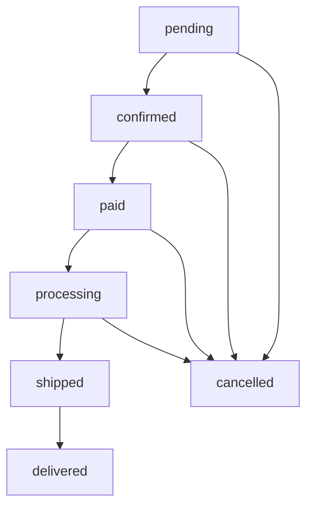

# 💳 Schéma des Paiements - FADIDI v20

## 📋 Vue d'ensemble

Le système de paiement FADIDI permet aux clients de passer des commandes avec plusieurs méthodes de paiement sécurisées. Le processus intègre un frontend JavaScript moderne avec une API NestJS backend pour la gestion des commandes et des transactions.

## 🏗️ Architecture du Système

```
┌─────────────────┐    ┌─────────────────┐    ┌─────────────────┐
│   Frontend      │    │   API NestJS    │    │   Base de       │
│   (boutique.html)│◄──►│   Backend       │◄──►│   Données       │
│                 │    │                 │    │   (MySQL)       │
└─────────────────┘    └─────────────────┘    └─────────────────┘
```

## 🔄 Flux de Paiement

### 1. **Ajout au Panier**
```
Client sélectionne produit → Ajout au panier → Mise à jour localStorage
```

### 2. **Informations Client**
```javascript
// Formulaire client requis
{
  name: "Nom complet",
  phone: "Numéro de téléphone", 
  email: "Email (optionnel)",
  address: "Adresse de livraison",
  city: "Ville"
}
```

### 3. **Sélection du Mode de Paiement**

#### 🏦 **Carte Bancaire/Visa**
```javascript
{
  cardNumber: "1234 5678 9012 3456",
  cardExpiry: "MM/YY",
  cardCvv: "123"
}
```

#### 📱 **Wave**
- Génération QR Code automatique
- Numéro Wave: Système interne
- Montant prérempli

#### 🍊 **Orange Money**
- Génération QR Code automatique  
- Numéro Orange Money: Système interne
- Montant prérempli

## 📊 Schéma de Base de Données

### Table `orders`
```sql
CREATE TABLE orders (
  id INT PRIMARY KEY AUTO_INCREMENT,
  customerName VARCHAR(255) NOT NULL,
  customerPhone VARCHAR(50) NOT NULL,
  customerEmail VARCHAR(255) NULL,
  deliveryAddress TEXT NOT NULL,
  deliveryCity VARCHAR(100) NOT NULL,
  deliveryTime VARCHAR(100) NULL,
  deliveryNotes TEXT NULL,
  items JSON NOT NULL,
  subtotal DECIMAL(10,2) NOT NULL,
  deliveryFee DECIMAL(10,2) NOT NULL,
  total DECIMAL(10,2) NOT NULL,
  paymentMethod ENUM('wave', 'orange', 'card', 'promotion') NOT NULL,
  status ENUM('pending', 'confirmed', 'paid', 'processing', 'shipped', 'delivered', 'cancelled') DEFAULT 'pending',
  source VARCHAR(50) NULL,
  paymentDate TIMESTAMP NULL,
  customerFeedback TEXT NULL,
  feedbackType VARCHAR(50) NULL,
  feedbackDate TIMESTAMP NULL,
  adminResponse TEXT NULL,
  adminResponseDate TIMESTAMP NULL,
  deliveredAt TIMESTAMP NULL,
  createdAt TIMESTAMP DEFAULT CURRENT_TIMESTAMP,
  updatedAt TIMESTAMP DEFAULT CURRENT_TIMESTAMP ON UPDATE CURRENT_TIMESTAMP
);
```

### Table `revenue`
```sql
CREATE TABLE revenue (
  id INT PRIMARY KEY AUTO_INCREMENT,
  total DECIMAL(15,2) NOT NULL,
  updatedAt TIMESTAMP DEFAULT CURRENT_TIMESTAMP ON UPDATE CURRENT_TIMESTAMP
);
```

## 🛠️ API Endpoints

### **Commandes**
```typescript
POST   /api/orders              // Créer une commande
GET    /api/orders              // Lister toutes les commandes
GET    /api/orders/:id          // Obtenir une commande par ID
GET    /api/orders/by-phone/:phone // Rechercher par téléphone
PATCH  /api/orders/:id          // Mettre à jour une commande
DELETE /api/orders/:id          // Supprimer une commande
GET    /api/orders/stats        // Statistiques des commandes
```

### **Revenus**
```typescript
POST   /api/orders/revenue      // Enregistrer le chiffre d'affaires
GET    /api/orders/revenue      // Récupérer le chiffre d'affaires
```

### **Feedback Client**
```typescript
POST   /api/orders/feedback               // Ajouter un retour client
GET    /api/orders/feedbacks/all          // Obtenir tous les retours
POST   /api/orders/:id/admin-response     // Réponse administrateur
```

## 🔐 Système de Sécurité

### **Validation Côté Frontend**
```javascript
// Validation des champs obligatoires
function validateOrderData(data) {
  if (!data.customerInfo.name) throw new Error('Nom requis');
  if (!data.customerInfo.phone) throw new Error('Téléphone requis');
  if (!data.customerInfo.address) throw new Error('Adresse requise');
  if (!data.paymentMethod) throw new Error('Méthode de paiement requise');
  return true;
}
```

### **Validation Côté Backend**
```typescript
// DTO avec validation automatique
export class CreateOrderDto {
  @IsString()
  customerName: string;

  @IsString()
  customerPhone: string;

  @IsEnum(['wave', 'orange', 'card', 'promotion'])
  paymentMethod: string;

  @IsEnum(['pending', 'confirmed', 'paid', 'processing', 'shipped', 'delivered', 'cancelled'])
  @IsOptional()
  status?: string;
}
```

## 💰 États des Commandes



### **Descriptions des États**
- **pending**: Commande créée, en attente de confirmation
- **confirmed**: Commande confirmée par le client
- **paid**: Paiement effectué et validé
- **processing**: Commande en préparation
- **shipped**: Commande expédiée
- **delivered**: Commande livrée
- **cancelled**: Commande annulée

## 💳 Méthodes de Paiement Supportées

### 1. **Wave** 🌊
- **Type**: Mobile Money Sénégal
- **Format**: QR Code généré automatiquement
- **Validation**: Simulation côté frontend

### 2. **Orange Money** 🍊  
- **Type**: Mobile Money multi-pays
- **Format**: QR Code généré automatiquement
- **Validation**: Simulation côté frontend

### 3. **Carte Bancaire** 💳
- **Type**: Visa/Mastercard
- **Champs requis**: Numéro, Date d'expiration, CVV
- **Validation**: Format et longueur

### 4. **Promotion** 🎁
- **Type**: Paiement via code promo
- **Usage**: Commandes promotionnelles

## 📱 Intégration Frontend

### **Classes JavaScript Principales**

#### `FadidiCart` (new-cart.js)
```javascript
class FadidiCart {
  // Gestion du panier
  addToCart(product)
  removeFromCart(productId)
  updateQuantity(productId, quantity)
  
  // Traitement commande
  async processOrder()
  async createOrder(orderData)
  async processPayment(order, paymentMethod)
  
  // Interface utilisateur
  showCheckoutForm()
  showOrderConfirmation(order)
  updateCartSummary()
}
```

#### `FadidiCartAPI` (nestjs-cart-api.js)
```javascript  
class FadidiCartAPI {
  // Communication avec l'API
  async checkout(customerData)
  async findOrdersByPhone(phone)
  async syncWithAPI(product)
  
  // Gestion panier
  calculateTotals()
  saveCartToStorage()
  loadCartFromStorage()
}
```

## 🎯 Exemple de Flux Complet

### **1. Client ajoute des produits**
```javascript
cart.addToCart({
  id: 1,
  name: "Produit A",
  price: 5000,
  quantity: 2
});
```

### **2. Client passe à la commande**
```javascript
const orderData = cart.collectOrderData();
// Collecte: informations client + méthode paiement
```

### **3. Validation et création**
```javascript
if (cart.validateOrderData(orderData)) {
  const order = await cart.createOrder(orderData);
  await cart.processPayment(order, orderData.paymentMethod);
}
```

### **4. Sauvegarde en base**
```typescript
// API NestJS
@Post()
async create(@Body() createOrderDto: CreateOrderDto) {
  const order = await this.ordersService.create(createOrderDto);
  return { success: true, data: order };
}
```

### **5. Confirmation client**
```javascript
cart.showOrderConfirmation(order);
cart.clearCart();
```

## 📈 Statistiques et Reporting

### **Métriques Disponibles**
```typescript
interface OrderStats {
  totalOrders: number;
  pendingOrders: number;
  completedOrders: number;
  totalRevenue: number;
}
```

### **Endpoint Statistiques**
```typescript
GET /api/orders/stats
// Retourne les statistiques complètes
```

## 🔧 Configuration et Déploiement

### **Variables d'Environnement**
```bash
# Base de données
DB_HOST=localhost
DB_PORT=3306
DB_USERNAME=fadidi_user
DB_PASSWORD=your_password
DB_DATABASE=fadidi_db

# API
API_PORT=3000
API_BASE_URL=http://localhost:3000/api
```

### **Scripts de Démarrage**
```bash
# Backend API
npm run start:dev

# Frontend
# Ouvrir directement boutique.html ou utiliser un serveur web
```

## 🐛 Debug et Résolution de Problèmes

### **Logs Frontend**
```javascript
// Activation des logs détaillés
console.log('🛒 Ajout au panier:', product);
console.log('💳 Traitement paiement:', paymentMethod);
console.log('✅ Commande créée:', order);
```

### **Vérification Base de Données**
```sql
-- Vérifier les commandes récentes
SELECT * FROM orders ORDER BY createdAt DESC LIMIT 10;

-- Statistiques par méthode de paiement
SELECT paymentMethod, COUNT(*) as count, SUM(total) as revenue 
FROM orders GROUP BY paymentMethod;
```

## 🚀 Évolutions Futures

### **Améliorations Prévues**
- ✅ Intégration API de paiement réelles (Wave API, Orange Money API)
- ✅ Système de notifications push
- ✅ Gestion avancée des stocks
- ✅ Interface d'administration complète
- ✅ Reporting avancé avec graphiques

### **Sécurité Renforcée**
- ✅ Chiffrement des données sensibles
- ✅ Authentification JWT
- ✅ Audit trail des transactions
- ✅ Protection CSRF/XSS

---

## 📞 Support

Pour toute question sur le système de paiement :
- 📧 Email: support@fadidi.com
- 📱 Téléphone: +221 XX XXX XX XX
- 🌐 Documentation: https://fadidi.com/docs

---

*Dernière mise à jour: Novembre 2025*
*Version: FADIDI v20*