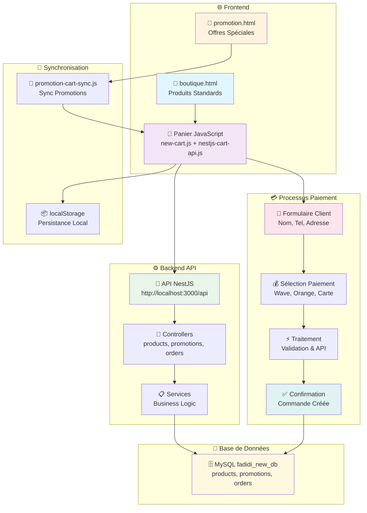
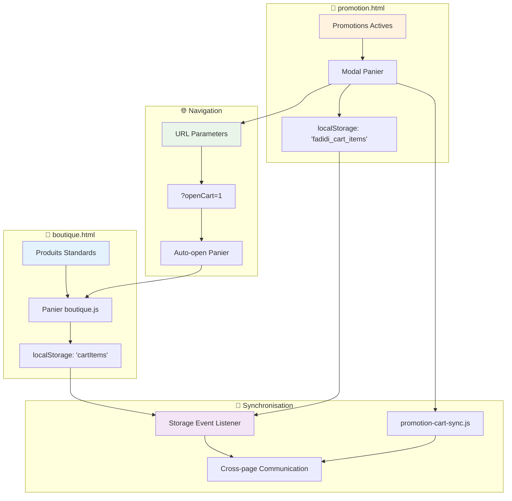
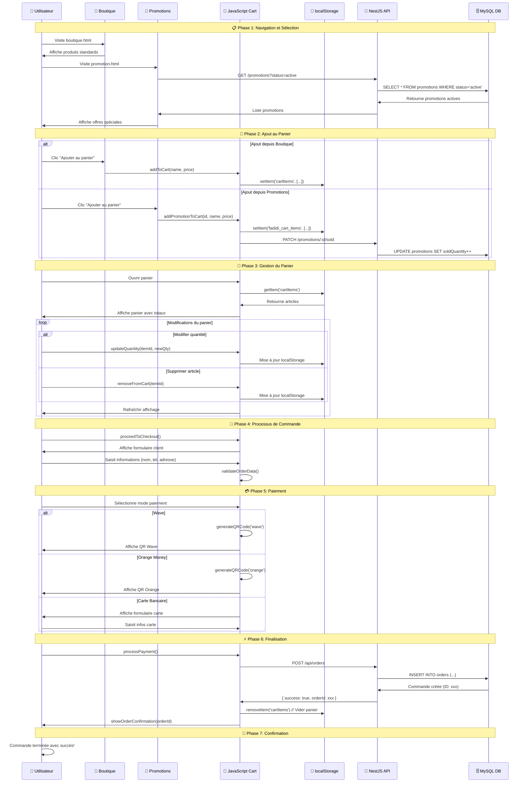
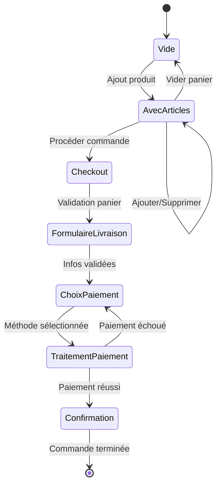
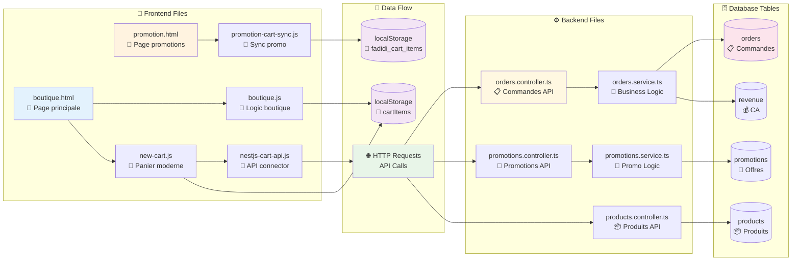
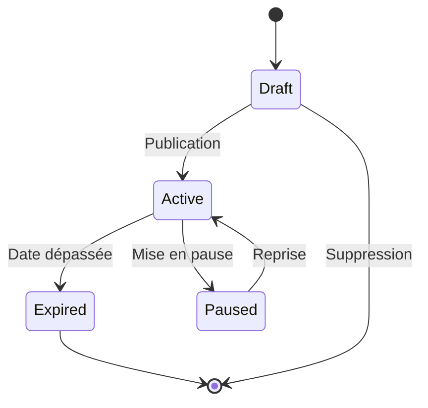

# 🛒 Schéma Complet : Panier → Boutique → Promotions → Paiement

## 📋 Vue d'ensemble du Système

Le système FADIDI intègre une boutique en ligne complète avec gestion des produits, promotions et paiements. Voici le flux complet du panier jusqu'au paiement.

## 🎯 Schéma Simple du Système

```
┌─────────────────┐    ┌─────────────────┐    ┌─────────────────┐
│     Frontend    │◄──►│   API NestJS    │◄──►│   Base de       │
│  (boutique.html)│    │    Backend      │    │   Données       │
└─────────────────┘    └─────────────────┘    └─────────────────┘
         │                       │                       │
         │                       │                       │
    ┌────▼────┐              ┌───▼───┐               ┌───▼───┐
    │ Panier  │              │Orders │               │MySQL  │
    │JavaScript│              │Service│               │Tables │
    └─────────┘              └───────┘               └───────┘
```

## 📊 Flux Complet : De la Navigation au Paiement

```
┌─────────────┐   ┌─────────────┐   ┌─────────────┐   ┌─────────────┐
│👤 Utilisateur│──►│🏪 Navigation │──►│🛒 Panier     │──►│💳 Paiement   │
│   arrive     │   │  Produits   │   │  & Checkout │   │ & Commande  │
└─────────────┘   └─────────────┘   └─────────────┘   └─────────────┘
       │                 │                 │                 │
       ▼                 ▼                 ▼                 ▼
┌─────────────┐   ┌─────────────┐   ┌─────────────┐   ┌─────────────┐
│ boutique.html│   │  Sélection  │   │ localStorage│   │  API POST   │
│promotion.html│   │  Articles   │   │   Stockage  │   │  /orders    │
└─────────────┘   └─────────────┘   └─────────────┘   └─────────────┘
```

## 🔄 Diagramme de Flux Détaillé

```
    [Démarrage]
         │
         ▼
┌────────────────┐
│  Boutique ou   │ ──┐
│  Promotions ?  │   │
└────────────────┘   │
         │           │
         ▼           │
┌────────────────┐   │
│ Ajouter article│◄──┘
│   au panier    │
└────────────────┘
         │
         ▼
┌────────────────┐
│ Panier rempli? │──── Non ────┐
└────────────────┘             │
         │ Oui                 │
         ▼                     │
┌────────────────┐             │
│  Formulaire    │             │
│    Client      │             │
└────────────────┘             │
         │                     │
         ▼                     │
┌────────────────┐             │
│ Choix Paiement │             │
│Wave│Orange│Visa│             │
└────────────────┘             │
         │                     │
         ▼                     │
┌────────────────┐             │
│ Traitement API │             │
│  POST /orders  │             │
└────────────────┘             │
         │                     │
         ▼                     │
┌────────────────┐             │
│  Confirmation  │             │
│   Commande     │             │
└────────────────┘             │
         │                     │
         ▼                     │
    [Terminé] ◄─────────────────┘
```

## 🏗️ Architecture Globale



## 🛣️ Schéma Détaillé du Flux Utilisateur

```mermaid
flowchart TD
    Start([👤 Utilisateur arrive]) --> Choice{Où va-t-il ?}
    
    Choice -->|Produits normaux| Boutique[🏪 boutique.html]
    Choice -->|Offres spéciales| Promotions[🎯 promotion.html]
    
    subgraph BoutiqueFlow ["📱 Flux Boutique"]
        Boutique --> Browse1[🔍 Parcourir produits]
        Browse1 --> Select1[✅ Sélectionner produit]
        Select1 --> Add1[➕ addToCart&#40;name, price&#41;]
        Add1 --> LocalStore1[💾 localStorage.setItem&#40;'cartItems'&#41;]
    end
    
    subgraph PromotionFlow ["🎯 Flux Promotions"]
        Promotions --> Browse2[🔍 Voir promotions actives]
        Browse2 --> Select2[✅ Sélectionner promotion]
        Select2 --> Add2[➕ addPromotionToCart&#40;id, name, price&#41;]
        Add2 --> Sync[🔄 PromotionCartSync.js]
        Sync --> LocalStore2[💾 localStorage.setItem&#40;'fadidi_cart_items'&#41;]
        Sync --> API1[📡 PATCH /promotions/:id/sold]
    end
    
    LocalStore1 --> CartCheck{🛒 Panier vide ?}
    LocalStore2 --> CartCheck
    
    CartCheck -->|Non| ShowCart[📋 Afficher panier]
    CartCheck -->|Oui| Browse1
    
    ShowCart --> CartActions{Action utilisateur}
    CartActions -->|Modifier quantité| UpdateQty[🔢 updateQuantity&#40;&#41;]
    CartActions -->|Supprimer article| RemoveItem[❌ removeFromCart&#40;&#41;]
    CartActions -->|Vider panier| ClearCart[🗑️ clearCart&#40;&#41;]
    CartActions -->|Commander| StartCheckout[🚀 proceedToCheckout&#40;&#41;]
    
    UpdateQty --> ShowCart
    RemoveItem --> ShowCart
    ClearCart --> Browse1
    
    StartCheckout --> ValidateCart{Panier valide ?}
    ValidateCart -->|Non| ShowCart
    ValidateCart -->|Oui| ClientForm[📝 Formulaire Client]
    
    ClientForm --> FillInfo[✍️ Saisir infos<br/>Nom, Tel, Email, Adresse]
    FillInfo --> ValidateInfo{Infos valides ?}
    ValidateInfo -->|Non| ClientForm
    ValidateInfo -->|Oui| PaymentChoice[💳 Choix paiement]
    
    subgraph PaymentFlow ["💰 Flux Paiement"]
        PaymentChoice --> PayWave[📱 Wave]
        PaymentChoice --> PayOrange[🍊 Orange Money]
        PaymentChoice --> PayCard[💳 Carte Bancaire]
        
        PayWave --> QRWave[📲 Générer QR Wave]
        PayOrange --> QROrange[📲 Générer QR Orange]
        PayCard --> CardForm[💳 Saisir infos carte]
        
        QRWave --> ProcessPayment[⚡ processPayment&#40;&#41;]
        QROrange --> ProcessPayment
        CardForm --> ProcessPayment
    end
    
    ProcessPayment --> CreateOrder[📦 Créer commande]
    CreateOrder --> APICall[📡 POST /api/orders]
    APICall --> SaveDB[(💾 Sauvegarder en DB)]
    SaveDB --> OrderConfirm[✅ Confirmation commande]
    
    OrderConfirm --> ClearCartFinal[🧹 Vider panier]
    ClearCartFinal --> ShowSuccess[🎉 Afficher succès]
    ShowSuccess --> End([🏁 Fin du processus])
    
    style Start fill:#4CAF50,color:#fff
    style End fill:#FF5722,color:#fff
    style CartCheck fill:#FF9800,color:#fff
    style ValidateCart fill:#FF9800,color:#fff
    style ValidateInfo fill:#FF9800,color:#fff
    style ProcessPayment fill:#9C27B0,color:#fff
    style SaveDB fill:#2196F3,color:#fff
```



## 📊 Structure de Base de Données

### **Table Produits (`products`)**
```sql
CREATE TABLE products (
  id VARCHAR(36) PRIMARY KEY,
  name VARCHAR(255) NOT NULL,
  description TEXT,
  price DECIMAL(10,2) NOT NULL,
  category VARCHAR(100),
  image VARCHAR(500),
  status ENUM('draft', 'published', 'archived') DEFAULT 'draft',
  isFeatured BOOLEAN DEFAULT false,
  stock INT DEFAULT 0,
  createdAt TIMESTAMP DEFAULT CURRENT_TIMESTAMP,
  updatedAt TIMESTAMP DEFAULT CURRENT_TIMESTAMP ON UPDATE CURRENT_TIMESTAMP
);
```

### **Table Promotions (`promotions`)**
```sql
CREATE TABLE promotions (
  id VARCHAR(36) PRIMARY KEY,
  title VARCHAR(255) NOT NULL,
  description TEXT,
  originalPrice DECIMAL(10,2) NOT NULL,
  promotionPrice DECIMAL(10,2) NOT NULL,
  discountPercentage DECIMAL(5,2) NOT NULL,
  startDate DATETIME NOT NULL,
  endDate DATETIME NOT NULL,
  status ENUM('draft', 'active', 'expired', 'paused') DEFAULT 'draft',
  image VARCHAR(500),
  maxQuantity INT DEFAULT 0,
  soldQuantity INT DEFAULT 0,
  isFeatured BOOLEAN DEFAULT false,
  productId VARCHAR(36),
  categoryId VARCHAR(36),
  createdAt TIMESTAMP DEFAULT CURRENT_TIMESTAMP,
  updatedAt TIMESTAMP DEFAULT CURRENT_TIMESTAMP ON UPDATE CURRENT_TIMESTAMP
);
```

### **Table Commandes (`orders`)**
```sql
CREATE TABLE orders (
  id INT PRIMARY KEY AUTO_INCREMENT,
  customerName VARCHAR(255) NOT NULL,
  customerPhone VARCHAR(50) NOT NULL,
  customerEmail VARCHAR(255),
  deliveryAddress TEXT NOT NULL,
  deliveryCity VARCHAR(100) NOT NULL,
  items JSON NOT NULL,
  subtotal DECIMAL(10,2) NOT NULL,
  deliveryFee DECIMAL(10,2) NOT NULL,
  total DECIMAL(10,2) NOT NULL,
  paymentMethod ENUM('wave', 'orange', 'card', 'promotion') NOT NULL,
  status ENUM('pending', 'confirmed', 'paid', 'processing', 'shipped', 'delivered', 'cancelled') DEFAULT 'pending',
  source VARCHAR(50),
  createdAt TIMESTAMP DEFAULT CURRENT_TIMESTAMP,
  updatedAt TIMESTAMP DEFAULT CURRENT_TIMESTAMP ON UPDATE CURRENT_TIMESTAMP
);
```

## 🔄 Flux Détaillé du Panier

### **1. Ajout de Produits au Panier**

#### **Depuis la Boutique (`boutique.html`)**
```javascript
// Fonction d'ajout depuis boutique.js
function addToCart(productName, productPrice) {
  const price = Number(productPrice);
  
  // Ajouter au panier local
  cartItems.push({ name: productName, price: price });
  
  // Sauvegarder dans localStorage
  localStorage.setItem('cartItems', JSON.stringify(cartItems));
  
  // Mettre à jour l'affichage
  updateCart();
  showAddedToCartNotification(productName);
}
```

#### **Depuis les Promotions (`promotion.html`)**
```javascript
// Système de synchronisation promotion → panier
class PromotionCartSync {
  async addPromotionToCart(promotionId, productName, price, imageUrl) {
    const cartProduct = {
      id: `promo_${promotionId}_${Date.now()}`,
      name: productName,
      price: parseFloat(price),
      image: imageUrl,
      promotionId: promotionId,
      isPromotion: true,
      quantity: 1
    };
    
    // Ajouter au panier local
    let localCart = JSON.parse(localStorage.getItem('fadidi_cart_items') || '[]');
    localCart.push(cartProduct);
    localStorage.setItem('fadidi_cart_items', JSON.stringify(localCart));
    
    // Incrémenter les ventes de la promotion
    await this.incrementPromotionSold(promotionId);
  }
}
```

### **2. Gestion du Panier avec l'API NestJS**

#### **Classe Principale (`FadidiCartAPI`)**
```javascript
class FadidiCartAPI {
  constructor() {
    this.API_BASE_URL = 'http://localhost:3000/api';
    this.cart = {
      items: [],
      subtotal: 0,
      deliveryFee: 0,
      total: 0
    };
  }
  
  // Ajouter un produit
  async addToCart(product) {
    const existingIndex = this.cart.items.findIndex(item => 
      item.name === product.name && item.price === product.price
    );
    
    if (existingIndex > -1) {
      this.cart.items[existingIndex].quantity += 1;
    } else {
      this.cart.items.push({...product, quantity: 1});
    }
    
    this.calculateTotals();
    this.saveCartToStorage();
    this.triggerCartUpdated();
  }
  
  // Supprimer un produit
  removeFromCart(productIndex) {
    const removedProduct = this.cart.items[productIndex];
    this.cart.items.splice(productIndex, 1);
    this.calculateTotals();
    this.saveCartToStorage();
    return removedProduct;
  }
  
  // Calculer les totaux
  calculateTotals() {
    this.cart.subtotal = this.cart.items.reduce((sum, item) => 
      sum + (item.price * item.quantity), 0
    );
    this.cart.deliveryFee = this.cart.subtotal > 10000 ? 0 : 1000;
    this.cart.total = this.cart.subtotal + this.cart.deliveryFee;
  }
}
```

### **3. Interface Utilisateur du Panier**

#### **Affichage du Panier (`boutique.html`)**
```html
<section id="panier" style="display: none;">
  <div class="cart-header">
    <h2>🛒 Votre Panier</h2>
    <button onclick="closeCart()" class="close-cart-btn">×</button>
  </div>
  
  <div id="cart-items" class="cart-items-container">
    <!-- Articles ajoutés dynamiquement par JavaScript -->
  </div>
  
  <div id="cart-summary" class="cart-summary">
    <div class="subtotal">
      <span>Sous-total:</span>
      <span id="cart-subtotal">0 CFA</span>
    </div>
    <div class="delivery-fee">
      <span>Frais de livraison:</span>
      <span id="cart-delivery-fee">1000 CFA</span>
    </div>
    <div class="total">
      <span>Total:</span>
      <span id="cart-total-amount">0 CFA</span>
    </div>
  </div>
  
  <button id="proceed-checkout" onclick="proceedToCheckout()">
    Passer la commande
  </button>
</section>
```

#### **Modal Panier sur Promotions (`promotion.html`)**
```html
<div id="cart-modal" class="cart-modal">
  <div class="cart-modal-content">
    <div class="cart-modal-header">
      <h2>🛒 Gestion du Panier</h2>
      <span onclick="closeCartModal()">&times;</span>
    </div>
    
    <div id="cart-items-list" class="cart-modal-items">
      <!-- Articles rendus par renderCartItems() -->
    </div>
    
    <div id="cart-summary" class="cart-modal-summary">
      <!-- Résumé calculé par renderCartSummary() -->
    </div>
    
    <div class="cart-modal-actions">
      <button onclick="clearAllCart()" class="btn-danger">
        🗑️ Vider le panier
      </button>
      <button onclick="goToCheckout()" class="btn-primary">
        💳 Commander
      </button>
    </div>
  </div>
</div>
```

## 💳 Processus de Checkout et Paiement

### **4. Formulaire de Commande**

#### **Étape 1: Informations Client**
```html
<section id="client-info" style="display: none;">
  <h2>📋 Vos Informations</h2>
  <form id="client-form">
    <div class="form-group">
      <label>Nom complet *</label>
      <input type="text" id="client-name" required>
    </div>
    
    <div class="form-group">
      <label>Téléphone *</label>
      <input type="tel" id="client-phone" required>
    </div>
    
    <div class="form-group">
      <label>Email</label>
      <input type="email" id="client-email">
    </div>
    
    <div class="form-group">
      <label>Adresse de livraison *</label>
      <textarea id="client-address" required></textarea>
    </div>
    
    <div class="form-group">
      <label>Ville *</label>
      <input type="text" id="client-city" required>
    </div>
    
    <button type="button" onclick="continueToPayment()">
      Continuer vers le paiement
    </button>
  </form>
</section>
```

#### **Étape 2: Sélection du Mode de Paiement**
```html
<section id="paiement" style="display: none;">
  <h2>💳 Mode de Paiement</h2>
  
  <div class="payment-options">
    <!-- Wave -->
    <div class="payment-option" onclick="selectPayment('wave')">
      
      <span>Wave</span>
    </div>
    
    <!-- Orange Money -->
    <div class="payment-option" onclick="selectPayment('orange')">
      
      <span>Orange Money</span>
    </div>
    
    <!-- Carte Bancaire -->
    <div class="payment-option" onclick="selectPayment('visa')">
      <i class="fas fa-credit-card"></i>
      <span>Carte Bancaire</span>
    </div>
  </div>
  
  <!-- Champs de saisie dynamiques selon la méthode -->
  <div id="visa-fields" style="display: none;">
    <input type="text" id="card-number" placeholder="Numéro de carte">
    <input type="text" id="card-expiry" placeholder="MM/YY">
    <input type="text" id="card-cvv" placeholder="CVV">
  </div>
  
  <div id="wave-fields" style="display: none;">
    <div id="wave-qr-code"></div>
    <p>Scannez le QR code avec votre app Wave</p>
  </div>
  
  <div id="orange-money-fields" style="display: none;">
    <div id="orange-qr-code"></div>
    <p>Scannez le QR code avec votre app Orange Money</p>
  </div>
  
  <button onclick="processPayment()" class="pay-btn">
    💰 Finaliser le paiement
  </button>
</section>
```

### **5. Traitement du Paiement**

#### **Validation et Création de Commande**
```javascript
async function processPayment() {
  // 1. Validation des champs de paiement
  const paymentMethod = getSelectedPaymentMethod();
  if (!validatePaymentFields(paymentMethod)) {
    return;
  }
  
  // 2. Récupération des informations client
  const customerData = {
    name: document.getElementById('client-name').value,
    phone: document.getElementById('client-phone').value,
    email: document.getElementById('client-email').value,
    address: document.getElementById('client-address').value,
    city: document.getElementById('client-city').value
  };
  
  // 3. Création de l'objet commande
  const orderData = {
    customerName: customerData.name,
    customerPhone: customerData.phone,
    customerEmail: customerData.email,
    deliveryAddress: customerData.address,
    deliveryCity: customerData.city,
    items: cartItems.map(item => ({
      name: item.name,
      price: item.price,
      quantity: item.quantity || 1,
      total: item.price * (item.quantity || 1),
      promotionId: item.promotionId || null
    })),
    subtotal: calculateSubtotal(),
    deliveryFee: calculateDeliveryFee(),
    total: calculateTotal(),
    paymentMethod: paymentMethod,
    status: 'pending'
  };
  
  // 4. Envoi à l'API
  try {
    const response = await fetch('/api/orders', {
      method: 'POST',
      headers: { 'Content-Type': 'application/json' },
      body: JSON.stringify(orderData)
    });
    
    if (response.ok) {
      const result = await response.json();
      showOrderConfirmation(result.data.id);
      clearCart();
    }
  } catch (error) {
    console.error('Erreur lors de la commande:', error);
  }
}
```

## 🔌 Architecture API et Flux de Données

```mermaid
graph TD
    subgraph "🌐 Client Requests"
        C1[GET /promotions?status=active]
        C2[POST /orders]
        C3[PATCH /promotions/:id/sold]
        C4[GET /products/published]
    end
    
    subgraph "🚀 NestJS Controllers"
        CTRL1[PromotionsController<br/>@Controller&#40;'promotions'&#41;]
        CTRL2[OrdersController<br/>@Controller&#40;'orders'&#41;]
        CTRL3[ProductsController<br/>@Controller&#40;'products'&#41;]
    end
    
    subgraph "⚙️ Services Layer"
        SVC1[PromotionsService<br/>Business Logic]
        SVC2[OrdersService<br/>Business Logic]
        SVC3[ProductsService<br/>Business Logic]
    end
    
    subgraph "🗄️ Database Repositories"
        REPO1[TypeORM Repository<br/>promotions]
        REPO2[TypeORM Repository<br/>orders]
        REPO3[TypeORM Repository<br/>products]
        REPO4[TypeORM Repository<br/>revenue]
    end
    
    subgraph "💾 MySQL Tables"
        TABLE1[(promotions<br/>id, title, prices,<br/>dates, status, soldQuantity)]
        TABLE2[(orders<br/>id, customer_info,<br/>items, total, status)]
        TABLE3[(products<br/>id, name, price,<br/>category, status)]
        TABLE4[(revenue<br/>id, total, updated_at)]
    end
    
    C1 --> CTRL1
    C2 --> CTRL2
    C3 --> CTRL1
    C4 --> CTRL3
    
    CTRL1 --> SVC1
    CTRL2 --> SVC2
    CTRL3 --> SVC3
    
    SVC1 --> REPO1
    SVC2 --> REPO2
    SVC2 --> REPO4
    SVC3 --> REPO3
    
    REPO1 --> TABLE1
    REPO2 --> TABLE2
    REPO3 --> TABLE3
    REPO4 --> TABLE4
    
    style C1 fill:#e1f5fe
    style C2 fill:#fff3e0
    style C3 fill:#f3e5f5
    style C4 fill:#e8f5e8
    style CTRL1 fill:#fff8e1
    style CTRL2 fill:#fff8e1
    style CTRL3 fill:#fff8e1
    style TABLE1 fill:#fce4ec
    style TABLE2 fill:#fce4ec
    style TABLE3 fill:#fce4ec
    style TABLE4 fill:#fce4ec
```

## 🔌 API Endpoints

### **Promotions**
```typescript
GET    /api/promotions                    // Toutes les promotions
GET    /api/promotions?status=active      // Promotions actives
GET    /api/promotions/featured           // Promotions en vedette
GET    /api/promotions/:id                // Promotion par ID
POST   /api/promotions                    // Créer une promotion
PATCH  /api/promotions/:id                // Modifier une promotion
PATCH  /api/promotions/:id/sold           // Incrémenter les ventes
DELETE /api/promotions/:id                // Supprimer une promotion
```

### **Produits**
```typescript
GET    /api/products                      // Tous les produits
GET    /api/products/published            // Produits publiés
GET    /api/products/featured             // Produits en vedette
GET    /api/products/:id                  // Produit par ID
POST   /api/products                      // Créer un produit
PATCH  /api/products/:id                  // Modifier un produit
DELETE /api/products/:id                  // Supprimer un produit
```

### **Commandes**
```typescript
GET    /api/orders                        // Toutes les commandes
GET    /api/orders/:id                    // Commande par ID
GET    /api/orders/by-phone/:phone        // Commandes par téléphone
POST   /api/orders                        // Créer une commande
PATCH  /api/orders/:id                    // Modifier une commande
DELETE /api/orders/:id                    // Supprimer une commande
GET    /api/orders/stats                  // Statistiques
```

## 📱 Responsivité et Mobile

### **Adaptation Mobile du Panier**
```css
@media (max-width: 768px) {
  #panier {
    position: fixed;
    top: 0;
    left: 0;
    width: 100vw;
    height: 100vh;
    z-index: 1000;
    padding: 20px;
    overflow-y: auto;
  }
  
  .cart-items-container {
    max-height: 60vh;
    overflow-y: auto;
  }
  
  .cart-item {
    padding: 10px;
    border-bottom: 1px solid #eee;
  }
  
  .cart-item img {
    width: 50px;
    height: 50px;
    object-fit: cover;
  }
}
```

## 🔄 Schéma de Synchronisation Multi-Pages



### **Communication entre Boutique et Promotions**
```javascript
// Système d'événements pour synchroniser les paniers
window.addEventListener('storage', function(e) {
  if (e.key === 'fadidi_cart_items') {
    // Recharger le panier quand il change
    loadCartFromStorage();
    updateCartDisplay();
  }
});

// Redirection avec panier ouvert
function goToCheckout() {
  window.location.href = 'boutique.html?openCart=1';
}

// Détection d'ouverture automatique du panier
if (window.location.search.includes('openCart=1')) {
  setTimeout(() => openCart(), 500);
}
```

## 💳 Schéma Détaillé du Processus de Paiement

```mermaid
flowchart TD
    Start([🛒 Panier Prêt]) --> CheckCart{Panier vide ?}
    CheckCart -->|Oui| EmptyMsg[⚠️ Message: Panier vide]
    CheckCart -->|Non| ShowForm[📝 Afficher formulaire client]
    
    EmptyMsg --> BackToBrowse[🔙 Retour navigation]
    
    ShowForm --> FillName[✍️ Nom complet]
    FillName --> FillPhone[📱 Téléphone]
    FillPhone --> FillEmail[📧 Email (optionnel)]
    FillEmail --> FillAddress[🏠 Adresse]
    FillAddress --> FillCity[🏙️ Ville]
    
    FillCity --> ValidateForm{Formulaire valide ?}
    ValidateForm -->|Non| ShowError[❌ Afficher erreurs]
    ShowError --> ShowForm
    
    ValidateForm -->|Oui| ShowPayment[💳 Choix paiement]
    
    ShowPayment --> PaymentChoice{Méthode choisie}
    
    subgraph "📱 Paiement Wave"
        PaymentChoice -->|Wave| ValidateWave{Champs Wave OK ?}
        ValidateWave -->|Non| ErrorWave[❌ Erreur Wave]
        ValidateWave -->|Oui| GenerateWaveQR[📲 Générer QR Wave]
        GenerateWaveQR --> ShowWaveQR[📱 Afficher QR Wave]
    end
    
    subgraph "🍊 Paiement Orange Money"
        PaymentChoice -->|Orange| ValidateOrange{Champs Orange OK ?}
        ValidateOrange -->|Non| ErrorOrange[❌ Erreur Orange]
        ValidateOrange -->|Oui| GenerateOrangeQR[📲 Générer QR Orange]
        GenerateOrangeQR --> ShowOrangeQR[🍊 Afficher QR Orange]
    end
    
    subgraph "💳 Paiement Carte"
        PaymentChoice -->|Carte| ShowCardForm[💳 Formulaire carte]
        ShowCardForm --> FillCardNumber[🔢 Numéro carte]
        FillCardNumber --> FillExpiry[📅 Date expiration]
        FillExpiry --> FillCVV[🔐 Code CVV]
        FillCVV --> ValidateCard{Carte valide ?}
        ValidateCard -->|Non| ErrorCard[❌ Erreur carte]
        ValidateCard -->|Oui| ProcessCard[💳 Traiter carte]
    end
    
    ErrorWave --> ShowPayment
    ErrorOrange --> ShowPayment
    ErrorCard --> ShowPayment
    
    ShowWaveQR --> ProcessPayment[⚡ processPayment()]
    ShowOrangeQR --> ProcessPayment
    ProcessCard --> ProcessPayment
    
    ProcessPayment --> CreateOrderData[📦 Créer orderData]
    CreateOrderData --> APICall[📡 POST /api/orders]
    
    APICall --> APIResponse{Réponse API}
    APIResponse -->|Erreur| ShowAPIError[❌ Erreur API]
    APIResponse -->|Succès| OrderCreated[✅ Commande créée]
    
    ShowAPIError --> ShowPayment
    
    OrderCreated --> GetOrderId[🆔 Récupérer Order ID]
    GetOrderId --> ClearCartData[🧹 Vider localStorage]
    ClearCartData --> ShowConfirm[🎉 Afficher confirmation]
    
    ShowConfirm --> UpdateUI[🔄 Mettre à jour UI]
    UpdateUI --> ShowSuccess[✨ Message succès]
    ShowSuccess --> ContinueShopping{Continuer ?}
    
    ContinueShopping -->|Oui| BackToBrowse
    ContinueShopping -->|Non| End([🏁 Fin])
    
    style Start fill:#4CAF50,color:#fff
    style End fill:#FF5722,color:#fff
    style CheckCart fill:#FF9800,color:#fff
    style ValidateForm fill:#FF9800,color:#fff
    style PaymentChoice fill:#9C27B0,color:#fff
    style ProcessPayment fill:#2196F3,color:#fff
    style OrderCreated fill:#4CAF50,color:#fff
```

## 🎯 États et Transitions

## 🎯 Schéma Détaillé des Interactions Système



### **États du Panier**


## 🗺️ Cartographie des Fichiers et Flux de Données



### **États des Promotions**


## 🛡️ Validation et Sécurité

### **Validation Frontend**
```javascript
function validateOrderData(data) {
  const errors = [];
  
  if (!data.customerInfo.name.trim()) {
    errors.push('Le nom est requis');
  }
  
  if (!data.customerInfo.phone.trim()) {
    errors.push('Le téléphone est requis');
  }
  
  if (!data.customerInfo.address.trim()) {
    errors.push('L\'adresse est requise');
  }
  
  if (!data.paymentMethod) {
    errors.push('La méthode de paiement est requise');
  }
  
  if (data.items.length === 0) {
    errors.push('Le panier est vide');
  }
  
  return errors;
}
```

### **Validation Backend (DTO)**
```typescript
export class CreateOrderDto {
  @IsString()
  @IsNotEmpty()
  customerName: string;

  @IsString()
  @IsNotEmpty()
  customerPhone: string;

  @IsEmail()
  @IsOptional()
  customerEmail?: string;

  @IsString()
  @IsNotEmpty()
  deliveryAddress: string;

  @IsArray()
  @ArrayNotEmpty()
  items: OrderItemDto[];

  @IsNumber()
  @Min(0)
  total: number;

  @IsEnum(['wave', 'orange', 'card', 'promotion'])
  paymentMethod: string;
}
```

## 📊 Gestion des Stocks et Promotions

### **Mise à jour automatique des stocks**
```javascript
// Lors de l'ajout au panier depuis une promotion
async function addPromotionToCart(promotionId, productName, price) {
  // 1. Ajouter au panier local
  await window.fadidiCartAPI.addToCart(product);
  
  // 2. Incrémenter la quantité vendue
  await fetch(`/api/promotions/${promotionId}/sold`, {
    method: 'PATCH',
    headers: { 'Content-Type': 'application/json' },
    body: JSON.stringify({ quantity: 1 })
  });
  
  // 3. Vérifier si la promotion est épuisée
  const promotion = await fetch(`/api/promotions/${promotionId}`);
  const data = await promotion.json();
  
  if (data.soldQuantity >= data.maxQuantity && data.maxQuantity > 0) {
    // Désactiver la promotion automatiquement
    await fetch(`/api/promotions/${promotionId}`, {
      method: 'PATCH',
      body: JSON.stringify({ status: 'expired' })
    });
  }
}
```

## 🔧 Debug et Monitoring

### **Logs de Debug**
```javascript
// Activation des logs détaillés
window.FADIDI_DEBUG = true;

// Logger les actions du panier
function logCartAction(action, item, details = {}) {
  if (window.FADIDI_DEBUG) {
    console.log(`🛒 [PANIER] ${action.toUpperCase()}:`, {
      item: item,
      timestamp: new Date().toISOString(),
      cartSize: this.cart.items.length,
      total: this.cart.total,
      ...details
    });
  }
}
```

### **Monitoring des Performances**
```javascript
// Mesurer les temps de chargement
performance.mark('cart-load-start');
await loadCartFromAPI();
performance.mark('cart-load-end');

const measure = performance.measure(
  'cart-load-time',
  'cart-load-start',
  'cart-load-end'
);

console.log(`⏱️ Chargement panier: ${measure.duration}ms`);
```

## 🚀 Évolutions et Améliorations

### **Prochaines Fonctionnalités**
- ✅ Panier persistant multi-sessions
- ✅ Recommandations de produits
- ✅ Codes de réduction
- ✅ Programme de fidélité
- ✅ Wishlist / Liste de souhaits
- ✅ Comparateur de produits
- ✅ Avis et évaluations
- ✅ Chat en direct
- ✅ Notifications push

### **Optimisations Techniques**
- ✅ Cache intelligent des produits
- ✅ Lazy loading des images
- ✅ Compression des données
- ✅ Service Worker pour offline
- ✅ Analytics avancés
- ✅ A/B Testing

---

**Documentation mise à jour le:** 5 Novembre 2025  
**Version FADIDI:** v20  
**API Version:** NestJS 9.x  

*Ce document couvre l'intégralité du flux : Produits → Promotions → Panier → Checkout → Paiement → Confirmation*